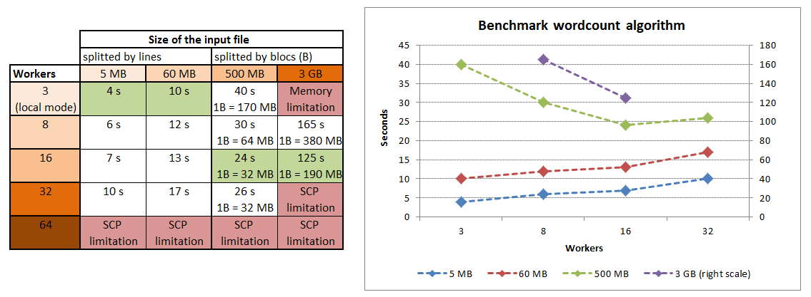
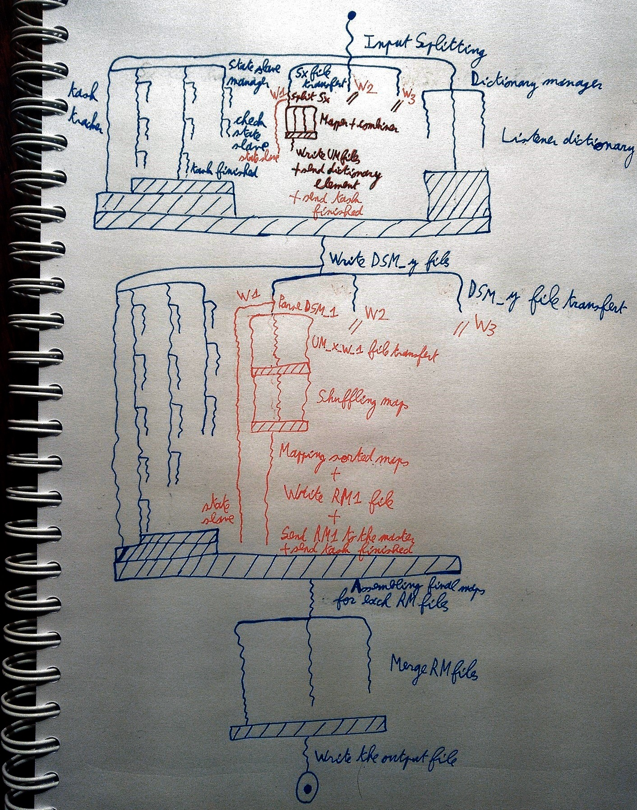

# Shavadoop

https://github.com/martin-prillard/shavadoop

My own implementation of Hadoop MapReduce in Java.

This includes :
* launch wordcount algorithm on large files with parallel distributed computing via multiple computers in a network
* task tracker to manage and relaunch task failed, thanks to socket communication
* manage files transfer between computers, thanks to scp
* manage the number of cores of each computer connected to optimize parallel computing



1 worker = 1 computer CPU's core

<br/>
## Hadoop VS Shavadoop

### Hadoop


### Shavadoop


**Initialization step :** the main repository is created / cleaned on each host and the network's ip adress may be automatically collected and stored if no source files are provided.

**Input splitting step :** the master split the file by line (if the size is less than 64 MB), else by blocs. Each bloc is send to the mapper worker for the next step.
<br/>*The file's name syntax : Sx, where x is a counter*

**Split mapping step :** each worker count the number of words in the file and create files in almost equal numbers of workers. Indeed, thanks to this trip, every word is on the right file for the right reducer worker :
```
// the hash on the key modulo the worker's number is always unique
Math.abs((int) (Util.simpleHash(key) % nbWorker)); 
```
It also noted that the combiner is integrated as standard. 
<br/>*The file's name syntax : UM_x_W_y_fullhostname, where x is the mapper worker's id and y is the right reducer worker's id*
<br/>At the end and thanks to socket communication, a dictionary is created to the next step : the shuffling.
<br/>*The file's name syntax : DSM_y, where y is the right reducer worker's id*

**Suffling maps step :** from the DSM file dictionary, each reducer worker get the files they need to parse to store the counters for each word in memory.

**Mapping sorted maps step :** each reducer worker sum all the counters of the last step and send to the master a file which contains this informations
<br/>*The file's name syntax : RM_y_fullhostname, where y is the reducer worker's id*

**Assembling final maps step :** it's the last step, the master can merge all the RM files in one.
<br/>*The file's name syntax : output, it's the result*

**The task tracker :** check frequently if a worker (mapper or reducer) is alive and it's working, thanks to socket communication. Else, the task tracker kill the job and relaunch the task on another worker available and ready to work hard.

#### Parallel distributed computing



<br/>
## How to use Shavadoop

1. clone the project with git
2. edit the config.properties file (included in the src root directory)
3. generate the jar file with your favorite IDE (or use the terminal like a boss)
4. from the terminal, execute the jar
5. have a coffee (or not)
6. enjoy the result with this command to see the thirty most frequently used words :
```
cat output | sort -k 2 -nr | head -30
```
<br/>
## To the future

* change Wordcount implementation to execute any algorithms
* export the properties file outside the jar (more convenient)
* optimize block's size in the Input Splitting step, with dynamic size (according to the number of mapper workers)
* when the input file is splited into several blocs, it could cut a word in half (serialization with Avro to avoid that ?)
* change the transfer file, currently with scp, by another way because scp has number limited connection (only socket ?)
* add JUnit test for regression testing
